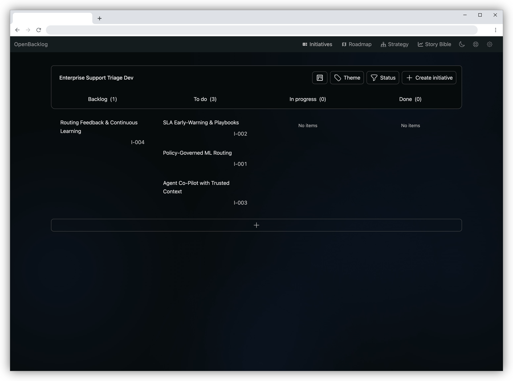

# OpenBacklog

**AI-powered product management for solo developers. Your strategy, your data, your AI.** OpenBacklog is the strategic layer that helps you decide *what* to build, not just execute tasks. Define your vision, plan your roadmap, and break strategy into actionable work, all while connecting your own AI via MCP.

[](https://opensource.org/licenses/MIT)
[](https://www.python.org/)
[](https://reactjs.org/)
[](https://fastapi.tiangolo.com/)

<p align="center">
  
</p>

**[Documentation](https://docs.openbacklog.ai)** · **[Quickstart](https://docs.openbacklog.ai/quickstart)** · **[MCP Setup](https://docs.openbacklog.ai/mcp-integration/claude-code)**

---

## Overview

Most developer tools focus on task execution. OpenBacklog adds the product management layer solo developers are missing.

| | Task Management Tools | OpenBacklog |
|---|---|---|
| **Focus** | Execute tasks from a list | Decide what to build and why |
| **Planning** | PRDs → Tasks | Vision → Strategy → Roadmap → Tasks |
| **AI Integration** | Built-in AI (subscription) | Bring your own AI via MCP |
| **Data** | Cloud-hosted | Self-hosted, you own it |
| **Cost** | Per-seat pricing | Free and open source |

## Features

- **Strategic Planning** — Define vision, pillars, outcomes, and themes. Think like a PM without being one.
- **Problem-First Planning** — Start with who you're building for and what problems they face.
- **MCP Integration** — Connect Claude Code, Cursor, or any MCP-compatible AI. No vendor lock-in.
- **Self-Hosted** — Your data stays on your machine. No tracking, no ads, no subscriptions.
- **Full API** — REST API for custom integrations and automation.

## Quick Start

```bash
git clone https://github.com/openbacklog/openbacklog.git
cd openbacklog
docker compose --env-file .env.cluster-dev up
```

Open http://localhost:8000 to get started.

See the [Quickstart Guide](https://docs.openbacklog.ai/quickstart) for detailed setup and [Claude Code Setup](https://docs.openbacklog.ai/mcp-integration/claude-code) to connect your AI.

## Contributing

Contributions welcome! See [CONTRIBUTING.md](./CONTRIBUTING.md) for guidelines.

## License

[MIT License](LICENSE)
